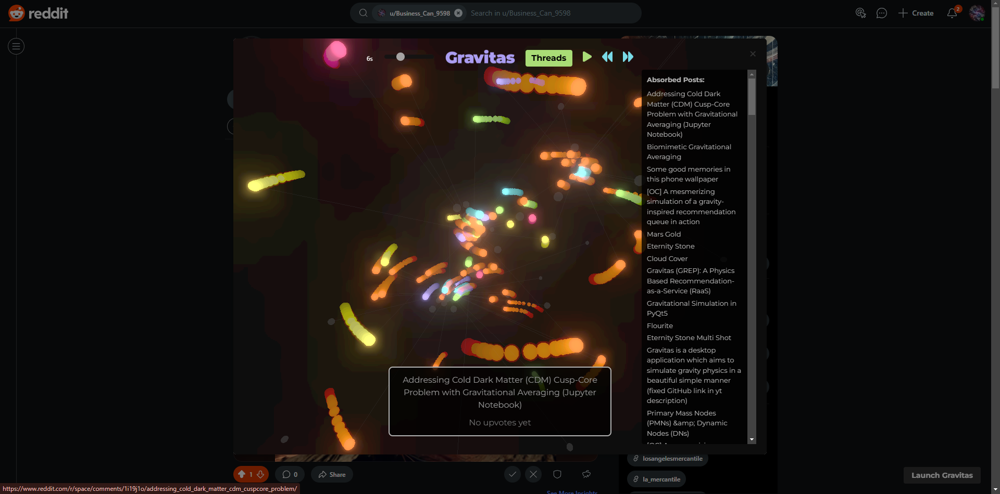
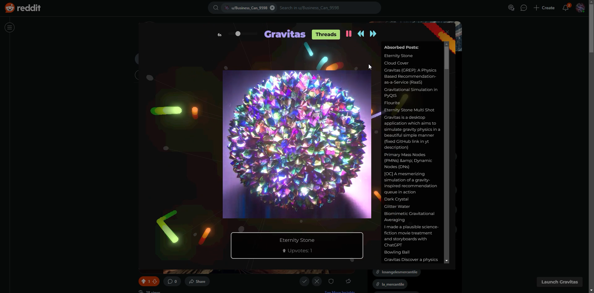

# **Gravitas Threads – A 3D Physics-Driven Reddit Explorer**  
🔥 **Forget scrolling. Posts move. Videos auto-play. Explore Reddit like never before.** 



🚀 **Reddit Player**  
💡 _A real-time physics-driven 3D experience._  
✅ **Videos & GIFs autoplay in full-screen**  
✅ **Real-time physics engine** (posts move dynamically based on upvotes & time)  
✅ **Zero lag, zero jank**—built for performance  
✅ **Animated, interactive post exploration**  
✅ **Transparent recommendation system** (no black-box AI)  

---

## **⚡ How it Works**
📌 Posts **orbit, move, and cluster** dynamically—no endless scrolling.  
🎥 Click GIFs & videos → **Instant full-screen playback.**  
🛰️ Experience **Reddit in motion.**  


## 🛠️ Installation for Developers

If you want to build and modify **Gravitas Threads**, follow these steps:

### 1️⃣ Clone the Repository  
```sh
git clone https://github.com/richfallatjr/gravitas-threads-chrome.git
cd gravitas-threads-chrome
```
### 2️⃣ Install Dependencies

Make sure you have Node.js installed, then run:
```sh
npm install
```
### 3️⃣ Build the Project
Use Webpack to bundle the extension:
```sh
npx webpack
``` 
This will create a dist/ folder with the built extension files.

### 4️⃣ Load into Chrome
Open Chrome and go to:
1. chrome://extensions/
2. Enable Developer Mode (top right corner).
3. Click Load Unpacked.
4. Select the dist/ folder from this repository. 
5. The extension should now be installed and ready to use!

## 📦 Latest Version ZIP File
If you don’t want to build it yourself, you can find the latest version ZIP file in the repository.

---

## **🔥 Install & Use the Published Extension**
### 🛠 **Installation**
1️⃣ **Install the App**: Approve permissions ([Chrome Store](https://chromewebstore.google.com/detail/gravitas-threads-reddit-p/jmalebenadmgjpnieneooompipjanndg)).  
2️⃣ **Navigate to Reddit**: Open a **subreddit or user page.**  
3️⃣ **Launch Gravitas**: Click the **Threads** button.  
4️⃣ **New pages? Reload Chrome** to fetch fresh data.  
5️⃣ **Clickable Video Support**: **Pause** animation & select glowing orange balls.  

---

## **🚀 Features & Updates**
✨ **New in v1.4:**
- 🎬 **Cinematic Dark Mode**  
- 🟠 **Glowing orange video balls** (easier to find)  
- 🖥️ **Improved graphics & UI**  
- 🎞️ **Motion blur & bloom effects**  
- ⚡ **Optimized performance**  
- 🎯 **More transparent recommendations**  

---

## **📸 Screenshots & GIFs**

**Example:**  
  
  

---

## **💡 Why Use Gravitas?**
✅ **It’s Free** – Just leave us a review to help us grow!  
✅ **A Next-Gen Reddit Experience** – More immersive than scrolling.  
✅ **Real Physics, Real Motion** – No static, no clunky UI.  

**🚀 Scroll You Later. This is Next-Gen Browsing.**  

---

## **🔗 Links & Social**
- **📥 Download:** [Chrome Store](https://chromewebstore.google.com/detail/gravitas-threads-reddit-p/jmalebenadmgjpnieneooompipjanndg)  
- **🌐 Website:** [Gravitas Discover](https://gravitasdiscover.com/gravitas-threads)  
- **📺 Video Demo:** [YouTube](https://youtube.com/shorts/7cBVgAZUk1U?si=Z2v1rueg9deVBij6)  
- **💬 Join the Discussion:** [Discord](https://discord.gg/VqyhwXBxKr)  

---

## **🌟 Support & Contribute**
💡 **Want to improve Gravitas Threads?**  
- **⭐ Star this repo** to support development!  
- **🛠 Contribute** – Open issues, suggest features, or fork it!  
- **Patreon** – (Optional) [Support](https://patreon.com/losangelesmercantile?utm_medium=unknown&utm_source=join_link&utm_campaign=creatorshare_creator&utm_content=copyLink) development efforts.  

📌 _Made with ❤️ for Reddit explorers._  

---